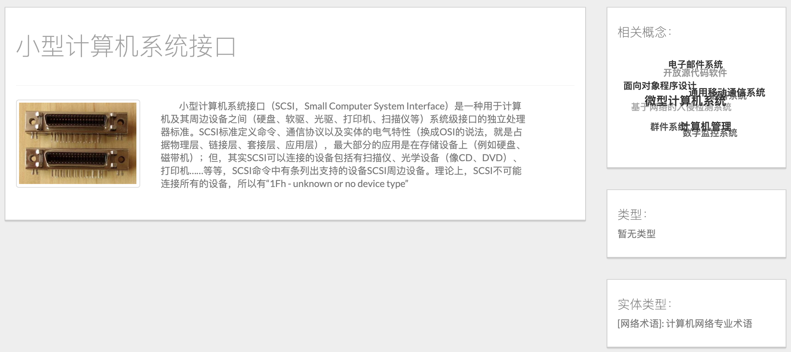
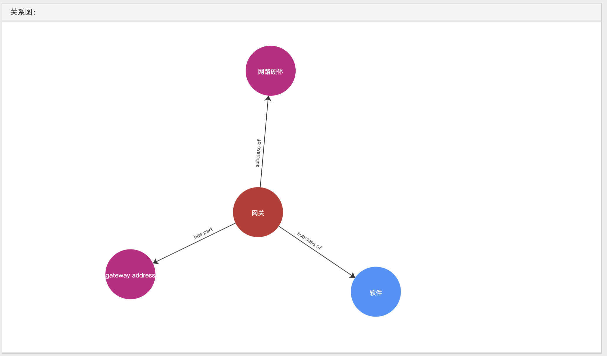
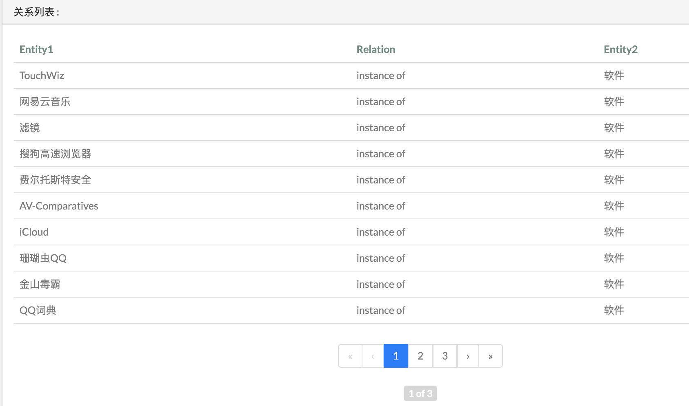
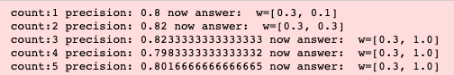

# 计算机网络知识图谱

模仿“农业知识图谱”开源项目，搭建一个小型的计算机网络知识图谱。

## 一、成果可视化展示

### 功能一、实体识别

输入一段文本后，采用预训练好的thulac进行分词，识别出数据库中已包含的计算机网络专业实体：


单击某个实体，进入实体详细信息页面，包括了从互动百科获取的实体的title、image、detail基本信息，以及由KNN预测出来的实体类型信息：


上图中右侧的“相关概念”词云是由词向量计算出的相似实体，单击其中一项，可进入该词条的详情界面：



### 功能二、实体查询

输入实体名称，查询数据库中的计算机网络实体：


从neo4j数据库中查询与该实体相关的实体，返回关系图及关系列表：




### 功能三、关系查询

可以输入实体1、实体2及关系条件，灵活进行关系查询。例如下图，查询“instance of 软件”：


搜索到关系图及关系列表如下：




## 二、实现过程

TODO:

- [x] 1 获取计算机网络语料库

  - [x] Scrapy爬取百度百科：一万多条
  - [x] Scrapy爬取互动百科：一万多条
  - [x] 数据清洗

- [x] 2 实体抽取：

  - [x] 分词：thulac工具

  - [x] 实体分类

    - [x] 人工标注词性：作为训练集
- [x] 词汇相似度计算，生成词向量
    - [x] KNN算法预测实体类别

- [x] 3 关系抽取：PCNN算法远程监督
- [x] wikidata中的三元组关系
  - [x] Wikidata中的实体爬取
  - [x] Wikidata中的实体关系爬取
  - [x] 中文维基语料库对齐
  
- [x] 4 Neo4j数据库环境搭建

- [x] 5 Django网站搭建：修改了原网站

1. 数据爬取
   1. 编写scrapy爬虫，从百度百科“计算机网络”词条出发，爬取相关词条，最大深度为3，共爬到一万六千多条词条
   2. 利用上述词条，从互动百科中爬取词条描述、图片等具体内容。由于互动百科的全面改版，项目中的原爬虫已经不能使用，且新界面无法爬取到词条相关关键词的信息
2. 实体抽取
   1. 为上述词条手工标注2000个实体，1为计算机网络术语，0为非计算机网络术语
   2. 使用KNN预测其余所有实体的类别
   3. 使用FastText模型生成词向量，为后续“查询相关实体”功能所用
3. 关系抽取
   1. 爬取了Wikidata公开知识库中所有三元组关系名
   2. 使用Scrapy爬虫爬取已预测类别的实体在Wikidata中的数据及相关实体
   3. 使用Scrapy爬虫爬取上述实体之间的实体关系
   4. 使用PCNN远程监督算法将三元组关系对齐到wiki语料库
4. 对原项目的Django网站进行了一些修改，保留实体识别、实体查询、关系查询功能
5. 在本机上搭建了Neo4j数据库环境，将数据导入

### 实体识别

1. 语料库：互动百科爬取的一万六千多个实体

2. 手工标注两千个实体，与计算机网络相关的实体标为1，其余无关实体标为0

3. 特征工程：采用fasttext模型+wiki.zh.bin词向量数据集来计算文本相似度

   1. 词汇相似度 title_simi

   2. 描述文本相似度 detail_simi（为了加快运算，取了前60字符）

      

4. 使用K折叠交叉验证的方式，挑选了一个合适的权重（title:0.3, detail:1.0），在手工标注的数据集上进行K折叠交叉验证，达到82.3%的准确率：

   

5. 预测一万六千多个实体的标签，实现命名实体识别：KNN预测不同实体之间的相似度，根据某实体的相似实体的类别来确定该词的类别。

###关系抽取

1. 人工标注少部分关系
2. 根据现有知识库Wikidata获取一定量的关系
3. 从Wikipedia语料库中的语句中提取特定语句结构，获取一定量的关系
4. 将Wikipedia语料库中的语句与已有关系对齐，采用PCNNs远程监督的方式提取关系


```c
.
├── data
│   ├── data crawl
│   │   ├── dfs_tree_crawler
│   │   │   └── baidubaike
│   │   │       └── baidubaike
│   │   │           ├── data
│   │   │           │   └── leaf_from_baidu.csv
│   │   │           └── spiders
│   │   │               └── network_baidu.py
│   │   ├── MyCrawler
│   │   │   └── MyCrawler
│   │   │       ├── data
│   │   │       │   └── hudong_pedia.json
│   │   │       └── spiders
│   │   │           └── hudong_pedia.py
│   │   └── wikidataSpider
│   │       ├── 1 wikidataCrawler // 从Wikidata中爬取的所有三元组关系，并与中文名相匹配
│   │       │   └── result.json
│   │       ├── 2 wikientities //将predict_labels中的实体爬出，得到entities.json
│   │       │   └── wikientities
│   │       │       ├── entities.json
│   │       │       └── spiders
│   │       │           └── getEntities.py
│   │       ├── 3 wikidataRelation //利用2中得到的实体，爬取Wikidata中这些实体之间的关系
│   │       │   ├── entityRelation.json
│   │       │   ├── preProcess.py
│   │       │   └── wikidataRelation
│   │       │       └── spiders
│   │       │           └── getEntityRelation.py
│   │       ├── 4 wikidataProcessing // 将3中得到的关系处理，方便导入neo4j中
│   │       │   ├── new_node.csv
│   │       │   ├── relationDataProcessing.py
│   │       │   └── wikidata_relation.csv
│   │       └── 5 wikiextractor // 获取和处理维基百科语料库
│   │       │   └── extracted
│   │       │       ├── convLan.py
│   │       │       ├── langconv.py
│   │       │       └── zh_wiki.py
│   │       ├── 6 TrainDataBaseOnWiki // 将4中三元组关系对齐到5中中文维基语料库上
│   │       │   └── readme.md
│   │       └── wikidataAnalyse // 单纯统计各种关系
│   └── data process
│       └── data processing
│           └── data
│               └── merge_table3.txt
├── entity process // 实体识别
│   ├── KNN_predict
│   │   ├── adjust_parameter.ipynb // K折交叉验证调整权重
│   │   ├── classifier.py // KNN分类器
│   │   ├── predict.py // 预测实体类别
│   │   ├── labels.txt // 2000多个手工标注的实体类别
│   │   └── predict_labels.txt
└── demo
```

## 三、反思与收获

### 反思

1. 数据量及质量不足：最初采用从互动百科广度优先搜索的方式搜索实体词条，且规模只限制在了不足两万条，导致数据量及质量不足，最终效果上来看，许多计算机网络相关实体并没有存入数据库中
2. 时间花费过长：由于wiki爬虫需要翻墙，网速不稳定，花了将近半个月的时间才搞定，耽误了许多时间；碰上考试周，也空置了一定时间，导致整个项目完成时间比较久
3. 关系对齐并没有完全完成：关系对齐工作需要处理极大量的语料库，受家里硬件条件限制，我总是运行没多久程序就宕机了；因此这部分工作只是实现了代码，但没有真正把结果跑出来，这也导致了数据库中的关系不够丰富

### 收获

1. 对整个项目的过程有了完整和细致的理解
2. 精进了爬虫、分词、网站搭建、Neo4j数据库的具体技术
3. 理解了实体抽取、关系抽取工作的内容以及步骤
4. 学会了KNN预测实体类别、PCNN关系对齐的算法
5. 从头到尾实现了一个小型知识图谱，比较有成就感
